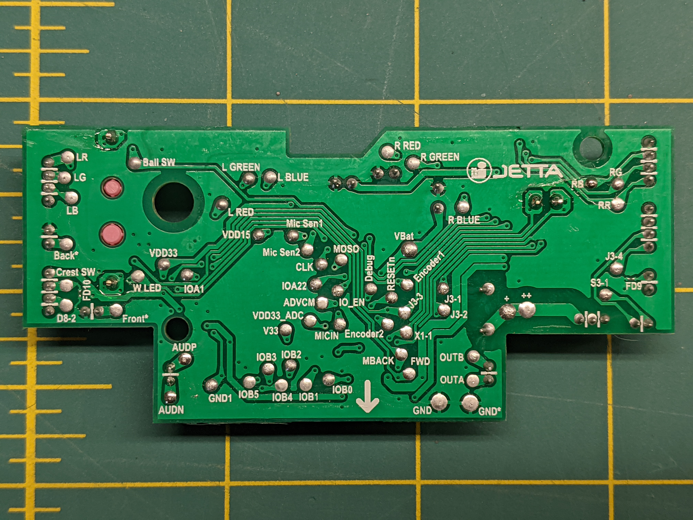

Wake up babe, new Furby just dropped!


# Initial Teardown

This was definitely designed to snap together easily, but releasing the snaps is difficult.

For releasing the fur from the base, the best I found was to use a small metal rod to slip into the hemicircular holes to press the tabs.


## First Thoughts

Head and stomach touch sensors are capacitive touch.

RGB LEDs in ears and forehead are common + (anode).

There's a single motor to drive all movement (like the original 1998 Furby).

Main processor is black blob.

I see no wireless components, so the Furby-to-Furby communication is probably ultrasonic. That'll be fun to probe later.





# Flash Dump

On board is a sop-8 marked 25L3233F which appears to be a MX25L3233F 32Mbit Serial NOR Flash memory.

`flashrom` wasn't sure exactly which flash chip it, but all four models it suggested dumped the same. (`MX25L3205(A)`, `MX25L3205D/MX25L3208`, `MX25L3206E/MX25L3208E`, and `MX25L3273E`)

The dump is `furby2023_flashdump.bin`.

It's a 4MB file with a reasonable bit of empty space. There are a good bit of debug message strings in it. `binwalk` struggles to tell me much about it.

I've made some attempts to load the dump into Ghidra. Best I can figure is it's little-endian ARM and should be loaded at 0x0400_0000 with a RAM section at 0x2000_0000. Both I and Ghidra are definitely struggling since we don't know what chip this is.


# (Not) Debug Pins

The back PCB has `Debug`, `RESETn`, `MOSO`, `CLK`, and `IO_EN` pins that look really interesting. Poking `CLK` and the other pins with a SWD programmer doesn't yield anything, and a JTAGulator didn't identify any pair as SWD. I see no traffic on any of the pins. `RESETn` does reset the processor.

I have no clue what `MOSO` is other than a typo.


# Code Execution by Flash Modification


I've patched in a spinlock at 0x0400_BFC2 which successfully triggers when running a "lightshow". A watchdog resets the Furby after about 2 seconds.

`Mic Sen1` is debug serial output

```
                             ?print_lightshow                                XREF[1]:     0400c050(*)  
        0400bfb4 04 23           movs       r3,#0x4
        0400bfb6 1b 02           lsls       r3,r3,#0x8
        0400bfb8 02 33           adds       r3,#0x2
        0400bfba 1b 02           lsls       r3,r3,#0x8
        0400bfbc 4c 33           adds       r3,#0x4c
        0400bfbe 1b 02           lsls       r3,r3,#0x8
        0400bfc0 5b 1c           adds       r3,r3,#0x1
        0400bfc2 98 47           blx        r3
        0400bfc4 24 e0           b          LAB_0400c010
```

```
                             **************************************************************
                             *                          FUNCTION                          *
                             **************************************************************
                             undefined codecave()
             undefined         r0:1           <RETURN>
                             codecave
        04024c00 f0 b5           push       {r4,r5,r6,r7,lr}
        04024c02 14 4b           ldr        r3,[near_ptr_print_string_ptr]                   = 58CDh
        04024c04 14 48           ldr        r0,[->newline_str]                               = 04024c60
        04024c06 98 47           blx        r3
        04024c08 00 24           movs       r4,#0x0
        04024c0a 16 4d           ldr        r5,[dump_start]
                             loop                                            XREF[1]:     04024c1a(j)  
        04024c0c 60 5b           ldrh       r0,[r4,r5]
        04024c0e 00 bf           nop
        04024c10 0f 4b           ldr        r3,[ptr_print_hex]                               = 5905h
        04024c12 30 b4           push       {r4,r5}
        04024c14 98 47           blx        r3
        04024c16 30 bc           pop        {r4,r5}
        04024c18 02 34           adds       r4,#0x2
        04024c1a f7 e7           b          loop


ldr r7, [ram_save_loc]
ldr r0, [r7,#0x4]
nop
ldr r3, [magic_number]
cmp r0, r3
beq carry_on_from_saved

nop
ldr r5, [dump_start]
movs r4, #0x0
str r5, [r7,#0x0]
str r3, [r7,#0x4]
nop
nop

carry_on_from_saved:
ldr r5, [r7,#0x0]
nop
nop
loop:
nop
nop

ldrh       r0,[r4,r5]
nop
ldr        r3,[ptr_print_hex]                               = 5905h
push       {r4,r5, r6, r7}
blx        r3
pop        {r4,r5, r6, r7}
adds       r4,#0x2
ldr r6, [chunk_size]
cmp r4, r6
blt loop

add r5, r6
str r5, [r7,#0x0]
nop
nop
nop
pop {r4,r5,r6,r7,pc}
```

`codecave_continue_motoridx.bin` when flashed will print out `0x4000` bytes of flash at a time when the motor moves.


I managed to dump 64k of flash (ROM?) at address 0. `full_internal_flash_0x0.bin`

There's a `CSPOTTER_ERR` string which lead me to the Cyberon CSpotter SDK:

```
The Cyberon CSpotter is a local voice trigger and command recognition solution that consumes very low resources and provides high accuracy performance. It runs on Renesas RA 32-bit microcontrollers (MCUs) with 120MHz of speed and enough memory to support multi-language commands as well as H/W crypto engine for strong security.
```

`0x0101_0010` reads as all `0x00`, so it's not an RA2E2 chip

`0x0100_80F0` reads as all `0x00`.

`0x4000_0000` reads as all `0x00`.

`0x5000_0000` has some stuff, but it's sparse. See `dump_5000_combined.bin`

`0xE000_0000` reads as all `0x00`.

Ram dump at `0x200_0000` can be found at `dump_ram.bin`. Note, `0x200033A8` and `0x200033AC` have been clobbered by my dumping code.

